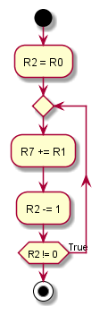
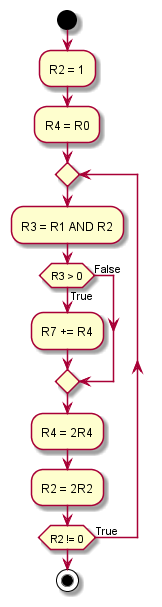

# lab1

<!-- TOC -->

- [lab1](#lab1)
    - [L版本](#l版本)
        - [L版本的设计思路](#l版本的设计思路)
        - [流程图](#流程图)
        - [代码实现](#代码实现)
        - [实现行数](#实现行数)
    - [P版本](#p版本)
        - [P版本的设计思路](#p版本的设计思路)
        - [流程图](#流程图-1)
        - [代码实现](#代码实现-1)
        - [指令执行条数](#指令执行条数)

<!-- /TOC -->

<div STYLE="page-break-after: always;"></div>

## L版本

### L版本的设计思路

采用循环累加的方式计算乘法，当操作数为负数时，由于采用补码存储，仍可循环累加

### 流程图



### 代码实现

```
0001 010 010 0 00 000 ; R2 = R0
0001 111 111 0 00 001 ; R7 += R1
0001 010 010 111111 ; R2 -= 1
0000 101 111111101 ; do it again if the R2 is not yet zero
```

### 实现行数

最初版本即最终版本，用**4**行实现

<div STYLE="page-break-after: always;"></div>

## P版本

### P版本的设计思路

单纯循环累加的方法复杂度为`O(n)`，为减少指令执行条数，可以采用将其中一个乘数分解为2的幂次的方法，如`5*7=5*(2^2+2^1+2^0)`，`a*(2^n)`易于从`a*(2^(n-1))`得到，则只需用一个寄存器逐次计算出一个乘数的`2^k,0<=k<=15`倍，并在另一个乘数的二进制`k+1`位为1时加到结果中即可

### 流程图



### 代码实现

```
0001 010 010 1 00001 ; R2 = 1
0001 100 100 0 00 000 ; R4 = R0
0101 011 001 0 00 010 ; AND R3, R1, R2
0000 110 000000001 ; if R3>0 R7+=R4
0001 111 111 0 00 100 ; R7+=R4
0001 100 100 0 00 100 ; R4 = 2R4
0001 010 010 0 00 010 ; R2 = 2R2
0000 101 111111010 ; do it again if the R2 is not yet zero
```

### 指令执行条数

此方法的复杂度为`O(logn)`，但指令执行条数与R0和R1具体值无关，恒为`6*16+2=98`条，故平均指令执行条数为**98**条

