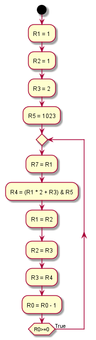

# lab2

<!-- TOC -->

- [lab2](#lab2)
    - [L版本](#l版本)
        - [L版本的设计思路](#l版本的设计思路)
        - [流程图](#流程图)
        - [代码实现](#代码实现)
        - [实现行数](#实现行数)

<!-- /TOC -->

<div STYLE="page-break-after: always;"></div>

## L版本

### L版本的设计思路

使用三个寄存器 `R1` `R2` `R3` 存储 `F(n-3)` `F(n-2)` `F(n-1)` 的值，把计算出的 `F(n)` 的值存储在 `R4` ，然后更新 `R1` `R2` `R3`，使用 `R0` 作为计数器

### 流程图



### 代码实现

```x86asm
.ORIG x3000
ADD R1,R1,#1
ADD R2,R2,#1
ADD R3,R3,#2
ADD R6,R6,#10
CAL ADD R5,R5,R5
ADD R5,R5,#1
ADD R6,R6,#-1
BRP CAL
STORE ADD R7,R1,#0
ADD R4,R1,R1
ADD R4,R4,R3
AND R4,R4,R5
ADD R1,R2,#0
ADD R2,R3,#0
ADD R3,R4,#0
ADD R0,R0,#-1
BRZP STORE
HALT
RESA .FILL #930
RESB .FILL #246
RESC .FILL #386
RESD .FILL #258
.END
```

我的学号为 `PB20111696`，a = 20 b = 11 c = 16 d = 96，计算出 `F(a) = 930` `F(b) = 246` `F(c) = 386` `F(d) = 258`

### 实现行数

最初版本即最终版本，用**22**行实现

