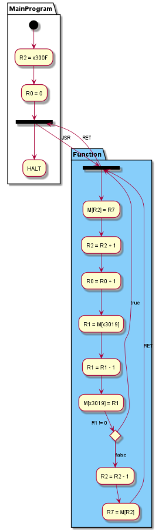
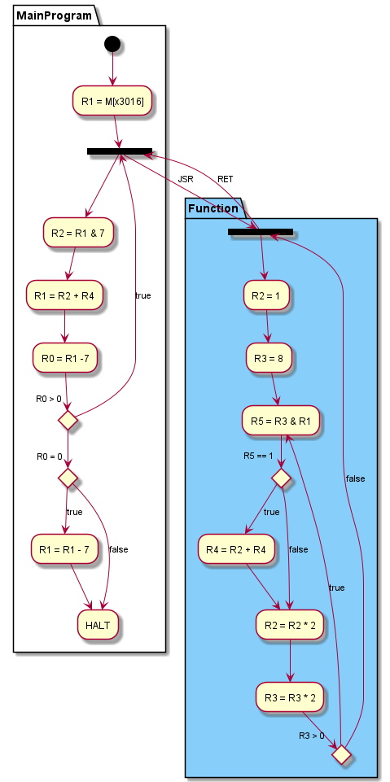

# lab4

[TOC]

## task1

### task1的解题思路

- 第三行为JSR指令，第四行为HALT指令，故推测JSR指令的PCoffset为1，子程序从第五行开始
- 第六行为ADD指令，根据初始时使用LEA在R2中存储x300F推测ADD指令的立即数为1
- 第九行为ADD指令，在子程序中每次R0增加1，最后R0为5，推测子程序执行五次，初始时x3019处存储的值为5，则每次R1读取x3019处的值，减一后再存回x3019

### 流程图



### 最终代码

```x86asm
1110010000001110
0101000000100000
0100100000000001
1111000000100101
0111111010000000
0001010010100001
0001000000100001
0010001000010001
0001001001111111
0011001000001111
0000010000000001
0100111111111000
0001010010111111
0110111010000000
1100000111000000
0000000000000000
0000000000000000
0000000000000000
0000000000000000
0000000000000000
0000000000000000
0000000000000000
0000000000000000
0000000000000000
0000000000000000
0000000000000101
```

## task2

### task2的解题思路

阅读程序可知基本思路是依据同余方程$x=8p+q\equiv p+q(mod 7)$来计算除7的余数，每次将操作数除8的商和余数相加得到的结果和原操作数除7时的余数相同，反复操作直到结果小于等于7，即可得到结果

### 流程图



### 最终代码

```x86asm
0010001000010101
0100100000001000
0101010001100111
0001001010000100
0001000001111001
0000001111111011
0001000001111001
0000100000000001
0001001001111001
1111000000100101
0101010010100000
0101011011100000
0101100100100000
0001010010100001
0001011011101000
0101101011000001
0000010000000001
0001100010000100
0001010010000010
0001011011000011
0000001111111010
1100000111000000
0000000100100000
```

