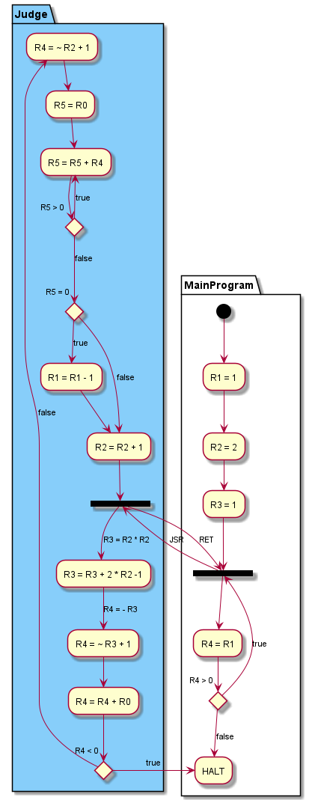

# lab5

[TOC]

## **Task**

### Task的实现思路

- 计算$i^2$:已知$(i-1)^2$时，$i^2=(i-1)^2+2i-1$
- 判断$R0\equiv0(modi)$ ：R0循环递减，每次减i直到R0小于等于0，若最后为0则R0能被i整除
- 循环调用子程序`JUDGE`直到$R1=0$或$i^2>R0$

### 流程图



### 最终代码

```x86asm
.ORIG x3000
AND R1,R1,#0
AND R2,R2,#0
AND R3,R3,#0
ADD R1,R1,#1
ADD R2,R2,#2
ADD R3,R3,#1
JSR JUDGE
ADD R4,R1,#0
BRP #-3
HALT
JUDGE   ADD R3,R3,#-1
        ADD R3,R3,R2
        ADD R3,R3,R2
        NOT R4,R3
        ADD R4,R4,#1
        ADD R4,R4,R0
        BRN #-8
        NOT R4,R2
        ADD R4,R4,#1
        ADD R5,R0,#0
        ADD R5,R5,R4
        BRP #-2
        BRN #1
        ADD R1,R1,#-1
        ADD R2,R2,#1
RET
.END
```
