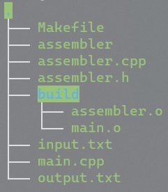

# README.md

## 运行环境的配置（Linux）

```bash
sudo apt install gcc g++ make build-essential 
```

安装编译工具 gcc g++ make build-essential

## 项目结构



## 编译与运行

在项目目录下执行`make`指令即可在项目目录下得到目标程序assembler，程序运行的具体参数可以用'-h'参数查看