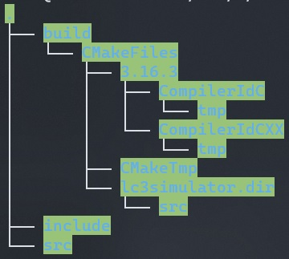

# README.md

## 运行环境的配置（Linux）

```bash
sudo apt install gcc g++ cmake build-essential 
```

安装编译工具 gcc g++ cmake build-essential

在https://www.boost.org/下载linux版本的boost库并依次执行`bootstrap.sh` `b2`完成boost库的编译与安装

## 项目结构



## 编译与运行

在build目录下依次执行`cmake ..` `make`指令即可在build目录下得到目标程序lc3simulator，程序运行的具体参数可以用'-h'参数查看